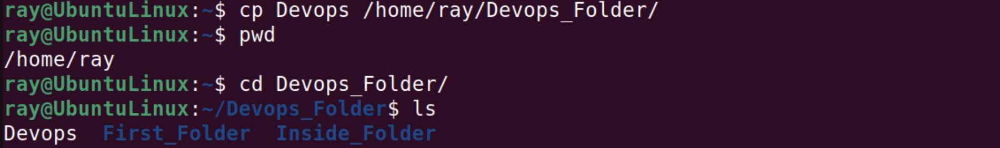
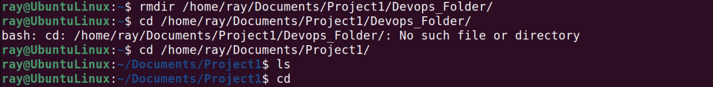
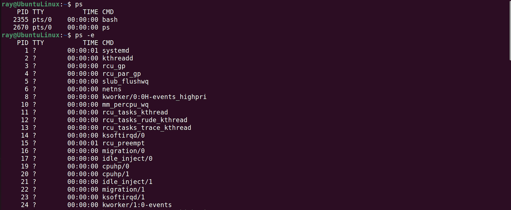

# Project 1 Linux Practice Project

In this page we will explore some basic Linux commands with a preview of how I run each commands step by steps.
---

### 1. Sudo Command:

Sudo which also means superuser allows me to perform task that requires administrative or root permission. 

`sudo apt upgrade`

This command simply upgrades packages that need to be upgraded.

---

### 2. Pwd Command:

`pwd`

The pwd tells shows that I am in the /home/ray directory

---

### 3. cd Command:

`cd | cd.. | cd ~ | cd -`

The cd command helps to navigate through folders and files. 
`cd` naturally takes you to home, `cd ..` take you one step backward through folders, `cd ~username` goes to another user home while `cd -` moves to the previous folder. 

---

### 4. Ls Command:

`ls`

ls command shows the current working directory content like files and folders.  `ls -a` shows hidden files, 

`ls -lh` shows file sizes in easily readable format such as MB, GB, TB. 

`ls -R` list all the files in the subdirectories.

---

### 5. cat Command:

`cat /home/ray/Devops`

The cat command which is also known as concatenate is used to read a file, multiple files together and even files between folders, here I am reading a file named Devops as shown below. 

---

### 6. cp Command:

`cp Devops /home/ray/Devops_Folder` 

This command basically means copying Devops file to Devops_Folder

`cp Devops Devops_New2` 

Here we make a duplicate of Devops as Devops_New2

`cp -R /home/ray/Downloads/Devops_Folder/ /home/ray/Documents/`

With the -R we are able to copy Devops_Folder which is inside the Downloads directory to a new Directory `Documents` 

### 7. mv Command:

`mv Devops /home/ray/Documents`

Here we use the mv command to move Devops file to Documents 

### 8. mkdir Command:

`mkdir Devops_Folder | mkdir /home/ray/Documents/Devops_Folder/Inside_Folder`

`mkdir` simply helps to create a new folder Devops_Folder or multiple folders at once. 

---

### 9. rmdir  Command:

`rmdir /home/ray/Documents/Project1/Devops_Folder`

The `rmdir` basically remove empty directories 

---

### 10. rm Command:

`rm -i Devops | rm -r /home/ray/Documents/Devops`

The `rm` remove files from directories `rm -i` promt system confirmation before deleting while the `rm -r` delete files and directories recursively. 

---

### 11. touch Command:

`touch index.html`

We use the `touch` command to create an empty file `index.html`

---

### 12. locate Command:

`locate -i Devops`

The locate command finds files in the system database, the `-i` turns of search case sensitivity. 

---

### 13. find Command:

`find /home -name Devops`

here we use find command to search files withing a specific directory.

---

### 14. grep Command:

`grep pwd /home/ray/Documents/Devops_Folder/Devops`

The `grep` commands help to search for words in a file and here we search for the word `pwd` in Devops file 

---

### 15. df Command:

`df -h`

df command simply reports the system or current directory disk usage `-h` flag prints this information in human readable format as shown below. 

---

### 16. du Command:

`du Documents`

This command checks how much space a file or directory takes up and it is important to specify the directory path when using du command.

---

### 17. head Command:

`head -n 5 Devops`

The head command view the first 10 lines of a text, adding -n 5 view the first 5 lines of Devops file. 

---

### 18. tail Command:

`tail -n 5 Devops`

Meanwhile, the tail command views the last 10 lines of a text, -n 5 also views the last 5 lines of Devops file as shown below. 

---

### 19. diff Command:

`diff Devops Devops_New`

This command analyzes and compares two different files line by line as we did with Devops and Devops_New.

`diff -c Devops Devops_New`

---

### 20. tar Command:

`tar -cvf newachive.tar /home/ray/`

`tar`  command simply archive multiple files into tar file. 

> tar header

> tar tail

---

### 21. chmod Command:

`chmod 777 Devops`

This command change a directory or file read, write and execute permission, In this case we allow all user class "Owner, group member and others" to read, write and execute `Devops` file with the numeric number 777 as shown below. 

---
### 22. chown Command:

`sudo chown Rasheed project1.md`

This command simply change ownership of a file, directory or symbolic link to a specified username, and here we change the project1.md file owner to Rasheed. 

---

### 23. jobs Command:

`jobs`

????

---
### 24. kill Command:

`kill`

????

---
### 25. ping Command:

`ping`

---

### 26. wget Command:

`wget`

?????

---
### 27. uname Command:

`uname`

prints detailed information about my Linux system and hardware. `-a` flat prints all the system information, `-s` prints the kernel name, while `-n` prints the node hostname. 

---
### 28. top Command:

`top`

This command displays all running processes and a dynamic real-time vew of the current system. It also identify and terminate a process that may use too many system resources. 

---

### 29. history Command:

`history`

simply list up to 500 previously executed commands, also allowing us to reuse them with re-entering.

---

### 30. man Command:

`man`

prints a user manual of any command or utilities you can run in the terminal, including the Name, Description and options. 

---
### 31. echo Command:

`echo`

A built-in utility that displays a line of text or string using the standard output. 

---
### 32. zip, unzip Command:

`zip archive.zip project1.md`

The zip command can compress a file to a Zip file, also can archive a file and directory to reduce disk usage.

`unzip achive.zip`

The unzip command unzip the zipped files from archive. 

---

### 33. hostname Command:

`hostname`

provides the system hostname, `-a` flag shows the hostname alias, `-A or --all-fqdns` shows the machine fully qualified domain name, `-i` shows the IP address as shown below

---

### 34. userdel, useradd Command:

`useradd -m Rasheed`

Adds user "Rasheed" to the system.

`passwd`

Sets the password for user Rasheed

![[passwd]](images/passwd.png)

`userdel`

This command deletes user "Rasheed" from the system.

?????

---

### 35. apt-get Command:

`sudo apt install vim `

A command-line tool for handling "Advance Package tool" Libraries in Linux. It manages, updates, remove and installs software and its dependencies.

---

### 36. nano, vi, jed Command:

`nano|vim|jed`

These three commands allow users to edit and manage files via text editor. 

---

### 37. alias, unalias Command:

`alias`

With alias command we create a shortcut with the same functionality as a command, file name or text. here we created a shortcut for `less` and `cat` command as shown below. 

`unalias`

Unalias simply deletes an existing alias

---

### 38. su Command:

`su`

Alias "switchuser"  allows us to run a program as a different user

---

### 39. htop Command:

`htop`

This command monitors system resources and server processes in real-time. 

---

### 40. ps Command:

`ps -e`

produces a snapshot of all running processes in the system 

