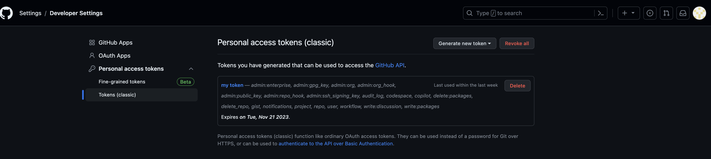

# Project 2 -- Basic Git Project

---

## Initializing a Repository and Making Commits 

I created a new file in the home directory called Devops_pbl and inside this folder, I ran the `git init` to reinitialise the repository in the Devops_pbl folder because I have run it before.

`git init`

After running `git init` we run the `git add .` to stage the modified index.htm and Project3 directory.

`git commit -m`

The -m specifies a commit message. 

---

## Working with Branches in Git

`git checkout -b newbranch`

The `git checkout` switch to a new branch while the -b creates a new branch. 

`git branch`

The `git branch` show list of running branch as shown below. 

`git checkout main`

The `git checkout` help switch between branches as shown below.

`git merge main`

In order to merge content in newbranch with main, we first checkout to newbranch with `git checkout newbranch` then we execute the `git merge main` .

`git branch -d newbranch`

Deleting `newbranch` from my branch list. 

---

## Collaboration and Remote Repository

After creating a github account, I created 2 Repositories, and one is Rasheed_PBL and the other is Rasheed_Devops. 
In this case, Rasheed_PBL will be linked to my local git repository. This allows me to push and pull codes from my local git repository to my GitHub repository. 

`git remote add origin` 

After the linking, I tried to push my git local Repository to GitHub with the command `git push origin main` and got an error.

> Github Personal access token

The error message led me to generate a token which was used to complete the linking and no error message popped when I tried to Push to guthub. 

`git remote seturl | git push origin main `

`git clone https://github.com/isiak44/Rasheed_Devops.git`

here I cloned my project1.md file and project2 folder, reason for that is to move them to my Rasheed_PBL repository on my github which has been linked to my local git repositories. 

 