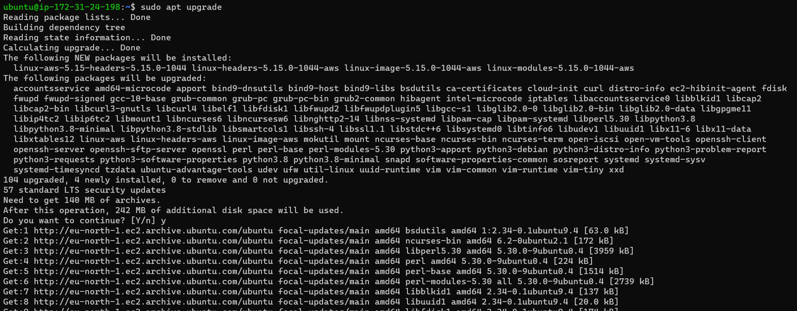
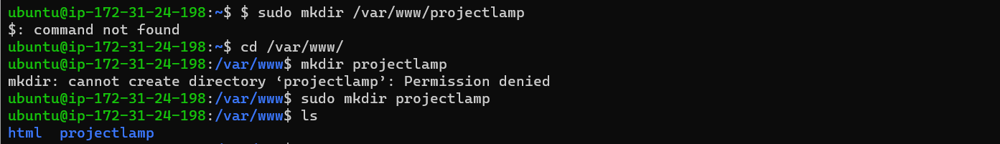

# Project 3 -- Lamp Stack Implemntation

In this project, we will deploy a LAMP stack web application on AWS Cloud server.
However, LAMP means Linux, Apache, Mysql, and PHP/Python or Perl. 

Lamp stack is a solution stack used in deploying web applications, linux is the operating system, Apache is a web server software, 

MySQL creates and maintain dynamic database, while 

PHP, PERL/ PYTHON represent the programming language used make web application contents. 

---

## EC2 Instance on AWS

First we create an EC2 ubuntu VM instance on our AWS server and when creating an instance we created a new keypair 'isiakec2.pem` on 
our local computer.

In Order to connect to this ec2. we `cd` into the directory containing the downloaded keypair and run the below code. 

`ssh -i isiak_ec2.pem ubuntu@ec2-13-53-106-58.eu-north-1.commute.amazonaws.com`

Running this ssh code on our terminal helps us connect to the ubuntu linux operating system we created on our aws server. 

`sudo chmod 0400 <private-key-name>.pem`

Then we change permission for the private key downloaded 

## Installing Apache and Updating Firewall

First we update our firewall with

`sudo apt update`

`sudo apt upgrade`

After the update, the terminal prompts to upgrade some packages. 

`sudo apt install apache2`

In order to Deployour website, we install apache with the ubuntu package manager `apt`

`sudo systemctl status apache2`

After successful installation we use this command to check the status of apache and here it shows running highlighted in green which means apache2 is active and ready to launch our first web server.

### Configuring Security Group Inbound Rules on Ec2 Instance

A security group act as a virtual firewall to the type of traffic that enters (inbound traffic) and leaves (outbound traffic) am instance)

In order to access our apache website locally from the internet with any public ip address, we create an inbound rule on aws ec2 security group settings and set http rule, port 80 and source 0.0.0.0/0 means from any IP address. 

 `curl http://localhost:80` or `curl http://127.0.0.1:80`

And to access this apache page locally in our ubuntu shell we use curl `http://localhost:80`

`http://<Public-IP-Address>:80`

Here we test how Apache http server can respond to requests from the internet by openening a web browser and running the ec2 public address. 

## Installing MySQL

MySQL is a Database Management system (DBMS) that stores and manage data for our website in a relational database. 

`sudo apt install mysql-server`

`sudo mysql`

This command connect to MySQL server as the administrative database user root

`ALTER USER 'root'@'localhost' IDENTIFIED WITH mysql_native_password BY 'PassWord.1';`

and with this command we set a default password for the root user using mysql native password `PassWord.1`

`exit`

then we exit back to our linux terminal. 

`sudo mysql_secure_installation`

Mysql installation footer

`sudo mysql -p`

## Installing php and its modules

PHP is a component part of our set LAMP stack setup that processes code to display dynamic content to the end user. In addition to the php package, we install `php-mysql` a PHP module that allows PHP to communicate with MySQL database. 
Then we added `libapache2-mod-php` to enable Apache to handle PHP files. To install these 3 packages at once we run

`sudo apt install php libapache2-mod-php php-mysql`

`php -v`

This command prints our php version. 

## Enbling PHP on the website

In order to launch our php page on apache, we modified the dir.conf file from `index.html` to `inde.php` to allow index.php become our default apache page.

`sudo vim /etc/apache2/mods-enabled/dir.conf`

`<IfModule mod_dir.c>
        From this:
        DirectoryIndex index.html index.cgi index.pl index.php index.xhtml index.htm
        To this:
        DirectoryIndex index.php index.html index.cgi index.pl index.xhtml index.htm
</IfModule>`

`sudo systemctl reload apache2`

After making this changes we reload apache2

`vim /var/www/projectlamp/index.php`

Here we created a PHP script to test that PHP is correctly installed and configured on the server.

`<?php
phpinfo();`

then we paste the PHP code to the index.php file in projectlamp host. 

`http://<Public-IP-Address>:80`

`$ sudo rm /var/www/projectlamp/index.php`

## Creating a virtual host for the website using apache

By default Apache has one server block enabled that is configured to serve documents from the `/var/www/html` directory. 

In the `/var/www/` directory, we create a new directory called projectlamp

`sudo mkdir /var/www/projectlamp`

`sudo chown -R $USER:$USER /var/www/projectlamp`

then we assign ownership of projectlamp directory to current system user.

`sudo vi /etc/apache2/sites-available/projectlamp.conf`

After that we then create an empty file called `projectlamp.conf`

`<VirtualHost *:80>
    ServerName projectlamp
    ServerAlias www.projectlamp 
    ServerAdmin webmaster@localhost
    DocumentRoot /var/www/projectlamp
    ErrorLog ${APACHE_LOG_DIR}/error.log
    CustomLog ${APACHE_LOG_DIR}/access.log combined
</VirtualHost>` 

then we copy the above code to `projectlamp.conf`

`sudo ls /etc/apache2/sites-available`.

list of sites available in apache, the 000-default.conf  is the apache configuration while the profjectlamp.conf prompt apache to serve `projectlamp` using `/var/www/projectlamp as its web root directory 

`sudo a2ensite projectlamp`

a2ensite command enables the new virtual host "projemplamp.conf"

`sudo a2dissite 000-default`

In order for Apache default conf page not to overwrite our new virtual host, we use `a2dissite` to disable apache default page. 

`sudo apache2ctl configtest`

To make sure the configuration file doesn't contain syntax errors, we use this command to test our conf

`sudo echo 'Hello LAMP from hostname' $(curl -s http://169.254.169.254/latest/meta-data/public-hostname) 'with public IP' $(curl -s http://169.254.169.254/latest/meta-data/public-ipv4) > /var/www/projectlamp/index.html`

This command created a new file `index.html` in `/var/www/projectlamp/` also to input some codes in the index.html file. 

`http://<Public-IP-Address>:80`

Now we check our website with the system browser using the public ip address and it shows what we have in `/var/www/projectlamp/index.html` which is our server public hostname and public ip address

