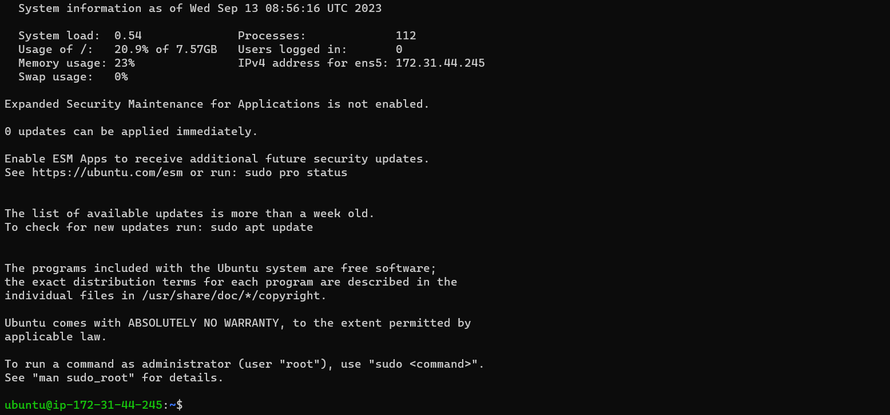
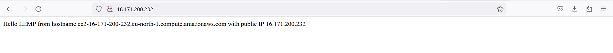

# Project 4 -- WEB Stack Implementation (LEMP Stack)

In this project, we will deploy a LEMP stack web application on an AWS Cloud server.
However, LEMP means Linux, Enginx, Mysql, PHP/Python, or Perl. 

LEMP stack is a solution stack used in deploying web applications, unlike LAMP we use Nginx as the web server for hosting web applications. 

## Launch EC2 Instance on Terminal with SSH

In Order to connect to this ec2. we `cd` into the directory containing the downloaded keypair and run the below code. 

`ssh -i isiak_ec2.pem ubuntu@ec2-172-31-44-245.eu-north-1.commute.amazonaws.com`

First, we update our firewall with `sudo apt update`

`sudo apt upgrade`

After the update, the terminal wants me to upgrade some packages. 

## Installing Nginx Web Server

`sudo apt install nginx`

`sudo systemctl status nginx`

After successful installation, we use this command to check the status of Apache and here it shows running, which means nginx is active and ready to launch our web server.

### Configuring Security Group Inbound Rules on Ec2 Instance

In order to access our nginx website locally or from the internet with any public IP address, we create an inbound rule on aws ec2 security group settings and set HTTP rule, port 80 and source 0.0.0.0/0 means from any IP address. 

`curl http://localhost:80`

To access our nginx page locally in our Ubuntu shell we use curl `http://localhost:80`

`http://<Public-IP-Address>:80`

Here we test how the nginx http server can respond to requests from the internet by opening a web browser and running the ec2 public address. 

## Installing MySQL

MySQL is a Database Management system (DBMS) that stores and manages data for our website in a relational database. 

`sudo apt install mysql-server`

`sudo mysql`

This command connects to MySQL server as the administrative database user root

`ALTER USER 'root'@'localhost' IDENTIFIED WITH mysql_native_password BY 'PassWord.1';`

and with this command, we set a default password for the root user using mysql native password `PassWord.1`

`exit`

then we exit back to our Linux terminal. 

`sudo mysql_secure_installation`

`sudo mysql -p`

---

## Installing php 

PHP is a component part of our set LEMP stack setup that processes code to display dynamic content to the end user. In addition to the php package, we install `php-mysql` a PHP module that allows PHP to communicate with MySQL database. 
Then we added `php-fpm` which stands for PHP fastCGI process manager. tells Nginx to pass PHP requests to this software for processing.

`sudo apt install php-fpm php-mysql`

### Configuring Nginx to Use PHP Processor

Nginx has one server blobk enabled by default and is configured to serve documents out of a directory at `/var/www/html`. While it works well for a single site, it may be hard to manage when hosting multiple sites. So in order not to modifile this `/var/www/html`, we'll create a directory structure within `/var/www` for our domain web. 

`sudo mkdir /var/www/projectLEMP`

Here we created a new directory called `projectLEMP` in `/var/www/`

`sudo chown -R $USER:$USER /var/www/projectLEMP`

Then we assign owner of projectLEMP to current system user.

After that, we then create a new config file `projectLEMP` in sites-available directory with 

`sudo nano /etc/nginx/sites-available/projectLEMP`

this command opens a new file, and then we paste the code below inside it ;

`server {

    listen 80;
    server_name projectLEMP www.projectLEMP;
    root /var/www/projectLEMP;

    index index.html index.htm index.php;

    location / {
        try_files $uri $uri/ =404;
    }

    location ~ \.php$ {
        include snippets/fastcgi-php.conf;
        fastcgi_pass unix:/var/run/php/php8.1-fpm.sock;
     }

    location ~ /\.ht {
        deny all;
    }

}`

After creating the projectLEMP config file in `/etc/nginx/sites-available`, we then link it to `/etc/nginx/sites-enabled` directory.

`sudo ln -s /etc/nginx/sites-available/projectLEMP /etc/nginx/sites-enabled/`

`sudo nginx -t`

This command tests our nginx configuration for syntax errors.

`sudo unlink /etc/nginx/sites-enabled/default`

With this command, we unlink or disable the Nginx default host that is currently configured to listen on port 80. 

`sudo systemctl reload nginx`

Then we reload Nginx.

`sudo echo 'Hello LAMP from hostname' $(curl -s http://169.254.169.254/latest/meta-data/public-hostname) 'with public IP' $(curl -s http://169.254.169.254/latest/meta-data/public-ipv4) > /var/www/projectlamp/index.html`

This command created a new file `index.html` in `/var/www/projectlamp/` also to input some codes in the index.html file. 

`http://<Public-IP-Address>:80`

Now we check our website with the system browser using the public ip address and it shows what we have in `/var/www/projectlamp/index.html` which is our server public hostname and public ip address

### Testing PHP with Nginx

In order to test PHP with Nginx we created a new file index.php in our web host projectLEMP and then pasted this PHP code 

`<?php
phpinfo();`. 

`nano /var/www/projectLEMP/index.php`

`http://`public_IP`/index.php`

`sudo rm /var/www/your_domain/index.php`

## Retrieving Data from MySQL Database with PHP

In order for Nginx web page to query data from MySQL, we need to create a test database with simple to do list and configure access to it. 

First we connect to MySQL server 

`sudo mysql -p`

`CREATE DATABASE "Isiak_database"; `

Createdn database in MySQL named `Isiak_database`

`CREATE USER 'isiak44'@'%' IDENTIFIED WITH mysql_native_password BY 'PassWord.1';`

Created a user named `isiak44` with default MySQL password `PassWord.1`

`GRANT ALL ON example_database.* TO 'example_user'@'%';`

This command grant user `isiak44` full privileges over `Isiak_database`

`mysql> exit`

Exit from MySQL to my Ubuntu Terminal. 

`sudo mysql -u isiak44 -p`

This command logged into the new user isiak44 in MySQL, `-p` promt the user to input password. 

`mysql> SHOW DATABASES;`

`CREATE TABLE Isiak_database.todo_list (item_id INT AUTO_INCREMENT,content VARCHAR(255),PRIMARY KEY(item_id));`

Here we created a test table in MySQL named `todo_list`

`INSERT INTO Isiak_database.todo_list (content) VALUES ("My first Project is Linux");`

Here we inserted a few rows in todo_list table as shown below.

`SELECT * FROM Isiak_database.todo_list;`

This command confirms that the inputed data is saved. 

`sudo nano /var/www/projectLEMP/todo_list.php`

Here we created a `todo_list.php` file that contains php script in our projectLEMP web root which connects to MySQL database and query for content in our todo_list table. 

After saving the php script, we then test the script by inputting the below code on our web browser. 

`http://<Public_IP/todo_list.php`

And here we have our test table on MySQL displayed on browser. 

---

### Challenges encountered in this project

Had a challenge with hosting PHP page on Nginx, I keep getting error whenever i launched my index.php on my webserver. 

In order to fix this error, I had to modify the version of php on my ProjectLEMP config file in `/etc/nginx/sites-available/projectLEMP` from `php8.1` to the current php version which is `php7.4`

